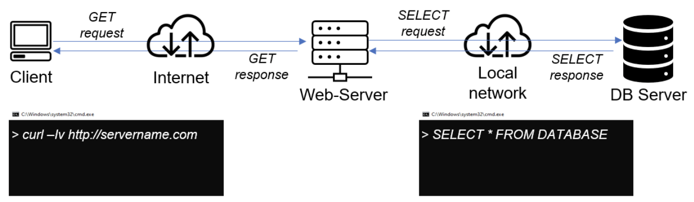
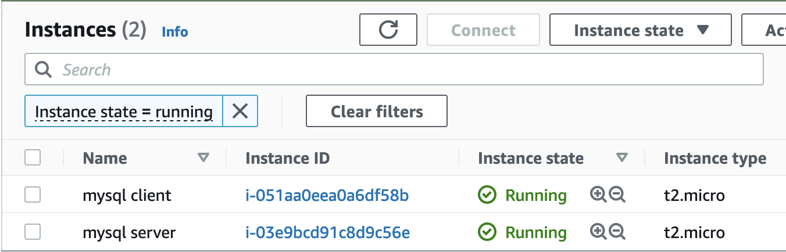
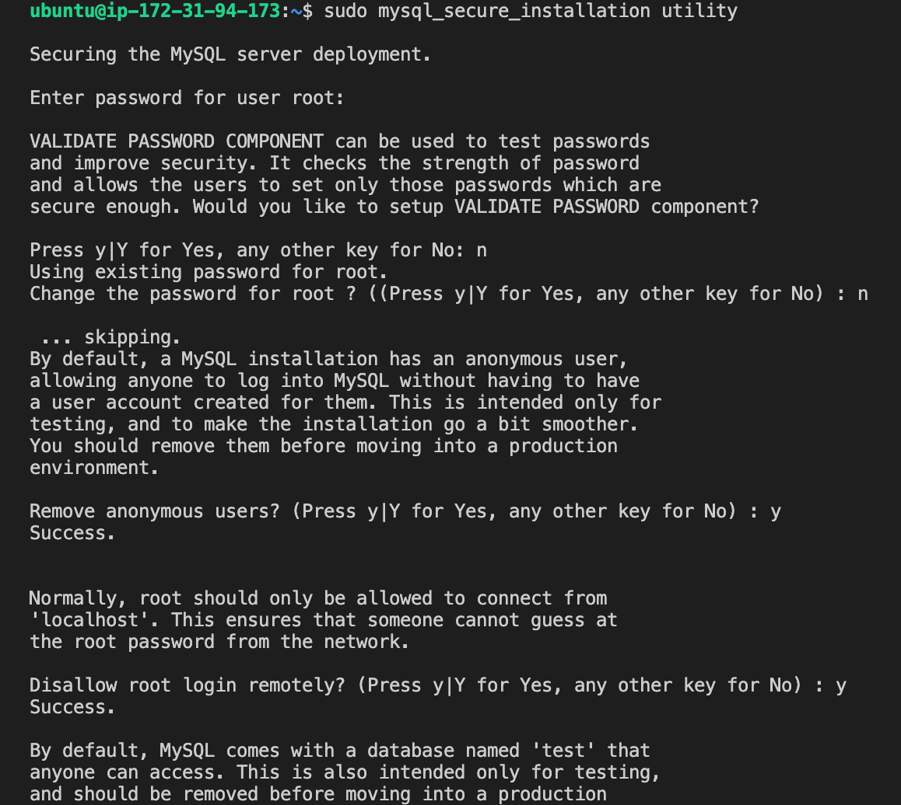
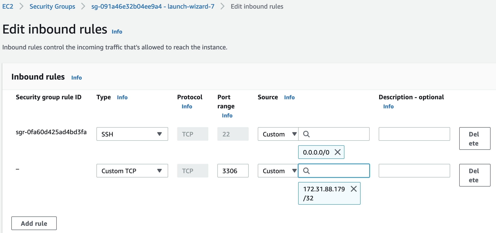

# Implement Client Server Architecture with MySQL on AWS

Client-Server refers to an architecture in which two or more computers are connected together over a network to send and receive requests between one another.

In their communication, each machine has its own role: the machine sending requests is usually referred as "Client" and the machine responding (serving) is called "Server".



## Step 0 - Create and Configure Two Linux-based EC2 Instances on AWS

    ```
    Server A name - mysql server
    Server B name - mysql client
    ```



## Step 1 - Install MySQL server software on **mysql server**

- Use 'apt' to install mysql server
  ```
  sudo apt install mysql-server
  ```
- Secure mysql Server

  ```
  sudo mysql
  ```

  ```
  ALTER USER 'root'@'localhost' IDENTIFIED WITH mysql_native_password BY 'SetRootPasswordHere';
  ```

  ```
  exit
  ```

  ```
  sudo mysql_secure_installation
  ```

  Follow the prompts to apply desired security.
  

- Exit
  ```
  exit
  ```

## Step 2 - Install MySQL client on **mysql client**

- Use 'apt' to install mysql client
  ```
  sudo apt install mysql-client
  ```

## Step 3 - Open Port 3306 on **mysql server**

MySQL server uses TCP port 3306 by default, so you will have to open it by creating a new entry in **Inbound rules** in **mysql server** Security Groups. For extra security, allow access only to the specific local IP address of the **mysql client**.

