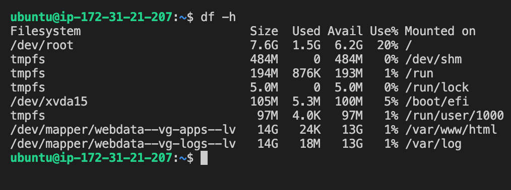

# Prepare Storage Infrastructure on Two Linux Servers and Implement a Basic Web solution using **WordPress**

This project consists of two parts:

1. Configure storage subsystem for Web and Database servers based on Linux OS.

2. Install WordPress and connect it to a remote MySQL database server.

## Step 1 - Prepare the Web Server

- Launch an EC2 instance that will serve as **Web Server**. Create 3 volumes in the same AZ as the Web Server EC2, each of 10 GiB
  

- Attach all three volumes one by one to the Web Server EC2 instance
  

### Begin Configuration

- Use **lsblk** command to inspect what block devices are attached to the server
  ```
  lsblk
  ```
  
- Use **df -h** command to see all mounts and free space on the server

  ```
  df -h
  ```

  

- Use **gdisk** utility to create a single partition on each of the 3 disks

  ```
  sudo gdisk /dev/xvdf
  ```

  

- Use the **lsblk** command to view the 3 newly created partitions

  ```
  lsblk
  ```

  

- Use **lvmdiskscan** command to check for available partitions

  ```
  sudo lvmdiskscan
  ```

  

- Use **pvcreate** utility to mark each of 3 disks as physical volumes (PVs) to be used by LVM
  ```
  sudo pvcreate /dev/xvdf1
  sudo pvcreate /dev/xvdg1
  sudo pvcreate /dev/xvdh1
  ```
- Use **pvs** command to verify that the physical volumes were created successfully

  ```
  sudo pvs
  ```

  

- Use **vgcreate** utility to add all 3 PVs to a volume group (VG) named **VG webdata-vg**
  ```
  sudo vgcreate webdata-vg /dev/xvdh1 /dev/xvdg1 /dev/xvdf1
  ```
- Use **vgs** command to verify that the VG was created successfully

  ```
  sudo vgs
  ```

  

- Use **lvcreate** utility to create 2 logical volumes: **apps-lv** (Use half of the PV size), and **logs-lv** Use the remaining space of the PV size. NOTE: apps-lv will be used to store data for the Website, while logs-lv will be used to store data for logs.
  ```
  sudo lvcreate -n apps-lv -L 14G webdata-vg
  sudo lvcreate -n logs-lv -L 14G webdata-vg
  ```
- Use **lvs** command to verify that the Logical Volumes were created successfully
  ```
  sudo lvs
  ```
  
- Verify the entire setup

  ```
  sudo vgdisplay -v #view complete setup - VG, PV, and LV
  ```

  ```
  sudo lsblk
  ```

  

- Use **mkfs.ext4** to format the logical volumes with **ext4** filesystem
  ```
  sudo mkfs -t ext4 /dev/webdata-vg/apps-lv
  sudo mkfs -t ext4 /dev/webdata-vg/logs-lv
  ```
- Create **/var/www/html** directory to store website files
  ```
  sudo mkdir -p /var/www/html
  ```
- Create **/home/recovery/logs** to store backup of log data
  ```
  sudo mkdir -p /home/recovery/logs
  ```
- Mount **/var/www/html** on apps-lv logical volume

  ```
  sudo mount /dev/webdata-vg/apps-lv /var/www/html/
  ```

- Use **rsync** utility to backup all the files in the log directory **/var/log** into **/home/recovery/logs** (This is required before mounting the file system)
  ```
  sudo rsync -av /var/log/* /home/recovery/logs/
  ```
- Mount **/var/log** on **logs-lv** logical volume. (Note that all the existing data on **/var/log** will be deleted. That was why it was backed up)
  ```
  sudo mount /dev/webdata-vg/logs-lv /var/log
  ```
- Restore log files back into **/var/log** directory
  ```
  sudo rsync -av /home/recovery/logs/* /var/log
  ```

### Update **/etc/fstab** file so that the mount configuration will persist after restart of the server.

- The UUID of the device will be used to update the **/etc/fstab** file;

  ```
  sudo blkid
  ```

  

- Update **/etc/fstab** using corresponding UUID without the quotes

  ```
  sudo vi /etc/fstab
  ```

  

- Test the configuration and reload the daemon
  ```
  sudo mount -a
  sudo systemctl daemon-reload
  ```
- Verify the setup by running **df -h**
  ```
  df -h
  ```
  

## Step 2 — Prepare the Database Server

- Launch a second RedHat EC2 instance that will have a role - **DB Server**
- Repeat the same steps as for the Web Server, but instead of apps-lv create db-lv and mount it to /db directory instead of /var/www/html/
  

## Step 3 — Install WordPress on the Web Server EC2

- Update the repository
  ```
  sudo yum -y update
  ```
- Install wget, Apache and it's dependencies
  ```
  sudo yum -y install wget httpd php php-mysqlnd php-fpm php-json
  ```
- Start Apache
  ```
  sudo systemctl enable httpd
  sudo systemctl start httpd
  ```
- Install PHP and it's depemdencies
  ```
  sudo yum install https://dl.fedoraproject.org/pub/epel/epel-release-latest-8.noarch.rpm
  sudo yum install yum-utils http://rpms.remirepo.net/enterprise/remi-release-8.rpm
  sudo yum module list php
  sudo yum module reset php
  sudo yum module enable php:remi-7.4
  sudo yum install php php-opcache php-gd php-curl php-mysqlnd
  sudo systemctl start php-fpm
  sudo systemctl enable php-fpm
  sudo setsebool -P httpd_execmem 1
  ```
- Restart Apache
  ```
  sudo systemctl restart httpd
  ```
- Download wordpress and copy wordpress to var/www/html
  ```
  mkdir wordpress
  cd   wordpress
  sudo wget http://wordpress.org/latest.tar.gz
  sudo tar xzvf latest.tar.gz
  sudo rm -rf latest.tar.gz
  sudo cp wordpress/wp-config-sample.php wordpress/wp-config.php
  sudo cp -R wordpress /var/www/html/
  ```
- Configure SELinux Policies
  ```
  sudo chown -R apache:apache /var/www/html/wordpress
  sudo chcon -t httpd_sys_rw_content_t /var/www/html/wordpress -R
  sudo setsebool -P httpd_can_network_connect=1
  ```

## Step 4 — Install MySQL on the DB Server EC2

```
sudo yum update
sudo yum install mysql-server
```

- Verify that the service is up and running by using sudo systemctl status mysqld, if it is not running, restart the service and enable it so it will be running even after reboot:
  ```
  sudo systemctl restart mysqld
  sudo systemctl enable mysqld
  ```

## Step 5 — Configure DB to work with WordPress

```
sudo mysql
```

- CREATE DATABASE wordpress
  ```
  CREATE USER `myuser`@`<Web-Server-Private-IP-Address>` IDENTIFIED BY 'mypass';
  GRANT ALL ON wordpress.* TO 'myuser'@'<Web-Server-Private-IP-Address>';
  FLUSH PRIVILEGES;
  SHOW DATABASES;
  exit
  ```

## Step 6 — Configure WordPress to connect to remote database.

Open MySQL port 3306 on DB Server EC2. For extra security, allow access to the DB server ONLY from your Web Server's IP address, so in the Inbound Rule configuration specify source as /32


- Install MySQL client and test that it can connect from the Web Server to the DB server by using mysql-client
  ```
  sudo yum install mysql
  sudo mysql -u admin -p -h <DB-Server-Private-IP-address>
  ```
- Verify if it can successfully execute SHOW DATABASES;
  

- Change permissions and configuration so Apache could use WordPress:
  Enable TCP port 80 in Inbound Rules configuration for your Web Server EC2 (enable from everywhere 0.0.0.0/0 )
  

- Try to access from a browser the link to the WordPress http://<Web-Server-Public-IP-Address>/wordpress/
