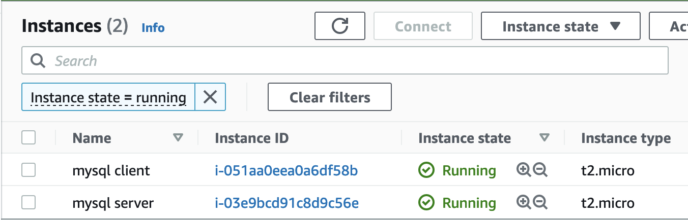
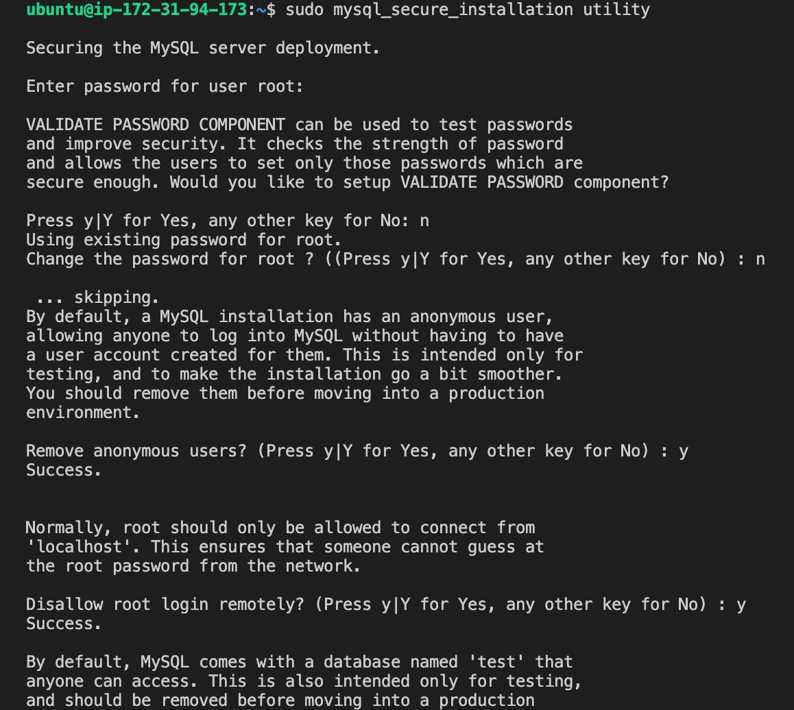

# Prepare Storage Infrastructure on Two Linux Servers and Implement a Basic Web solution using **WordPress**

This project consists of two parts:

1. Configure storage subsystem for Web and Database servers based on Linux OS.

2. Install WordPress and connect it to a remote MySQL database server.

## Step 1 - Prepare the Web Server

- Launch an EC2 instance that will serve as **Web Server**. Create 3 volumes in the same AZ as the Web Server EC2, each of 10 GiB
  

- Attach all three volumes one by one to the Web Server EC2 instance
  

### Begin Configuration

- Use **lsblk** command to inspect what block devices are attached to the server
  ```
  lsblk
  ```
  
- Use **df -h** command to see all mounts and free space on the server

  ```
  df -h
  ```

  

- Use **gdisk** utility to create a single partition on each of the 3 disks

  ```
  sudo gdisk /dev/xvdf
  ```

  

- Use the **lsblk** command to view the 3 newly created partitions

  ```
  lsblk
  ```

  

- Use **lvmdiskscan** command to check for available partitions

  ```
  sudo lvmdiskscan
  ```

  

- Use **pvcreate** utility to mark each of 3 disks as physical volumes (PVs) to be used by LVM
  ```
  sudo pvcreate /dev/xvdf1
  sudo pvcreate /dev/xvdg1
  sudo pvcreate /dev/xvdh1
  ```
- Use **pvs** command to verify that the physical volumes were created successfully

  ```
  sudo pvs
  ```

  

- Use **vgcreate** utility to add all 3 PVs to a volume group (VG) named **VG webdata-vg**
  ```
  sudo vgcreate webdata-vg /dev/xvdh1 /dev/xvdg1 /dev/xvdf1
  ```
- Use **vgs** command to verify that the VG was created successfully

  ```
  sudo vgs
  ```

  

- Use **lvcreate** utility to create 2 logical volumes: **apps-lv** (Use half of the PV size), and **logs-lv** Use the remaining space of the PV size. NOTE: apps-lv will be used to store data for the Website, while logs-lv will be used to store data for logs.
  ```
  sudo lvcreate -n apps-lv -L 14G webdata-vg
  sudo lvcreate -n logs-lv -L 14G webdata-vg
  ```
- Use **lvs** command to verify that the Logical Volumes were created successfully
  ```
  sudo lvs
  ```
  
- Verify the entire setup

  ```
  sudo vgdisplay -v #view complete setup - VG, PV, and LV
  ```

  ```
  sudo lsblk
  ```

  

- Use **mkfs.ext4** to format the logical volumes with **ext4** filesystem
  ```
  sudo mkfs -t ext4 /dev/webdata-vg/apps-lv
  sudo mkfs -t ext4 /dev/webdata-vg/logs-lv
  ```
- Create **/var/www/html** directory to store website files
  ```
  sudo mkdir -p /var/www/html
  ```
- Create **/home/recovery/logs** to store backup of log data
  ```
  sudo mkdir -p /home/recovery/logs
  ```
- Mount **/var/www/html** on apps-lv logical volume

  ```
  sudo mount /dev/webdata-vg/apps-lv /var/www/html/
  ```

- Use **rsync** utility to backup all the files in the log directory **/var/log** into **/home/recovery/logs** (This is required before mounting the file system)
  ```
  sudo rsync -av /var/log/* /home/recovery/logs/
  ```
- Mount **/var/log** on **logs-lv** logical volume. (Note that all the existing data on **/var/log** will be deleted. That was why it was backed up)
  ```
  sudo mount /dev/webdata-vg/logs-lv /var/log
  ```
- Restore log files back into **/var/log** directory
  ```
  sudo rsync -av /home/recovery/logs/* /var/log
  ```
- Update **/etc/fstab** file so that the mount configuration will persist after restart of the server.

      ```
      Server A name - mysql server
      Server B name - mysql client
      ```

  

## Step 1 - Install MySQL server software on **mysql server**

- Use 'apt' to install mysql server
  ```
  sudo apt install mysql-server
  ```
- Secure mysql Server

  ```
  sudo mysql
  ```

  ```
  ALTER USER 'root'@'localhost' IDENTIFIED WITH mysql_native_password BY 'SetRootPasswordHere';
  ```

  ```
  exit
  ```

  ```
  sudo mysql_secure_installation
  ```

  Follow the prompts to apply desired security.
  

- Exit
  ```
  exit
  ```

## Step 2 - Install MySQL client on **mysql client**

- Use 'apt' to install mysql client
  ```
  sudo apt install mysql-client
  ```

## Step 3 - Open Port 3306 on **mysql server**

MySQL server uses TCP port 3306 by default, so you will have to open it by creating a new entry in **Inbound rules** in **mysql server** Security Groups. For extra security, allow access only to the specific local IP address of the **mysql client**.


## Step 4 - Configure MySQL server to allow connections from remote hosts.

    ```
    sudo vi /etc/mysql/mysql.conf.d/mysqld.cnf
    ```

Replace **127.0.0.1** to **0.0.0.0** like this:


## Step 6 - Connect to mysql server from mysql client

```
mysql -h 3.92.181.197 -u calistus -pcalistus
```

```
show databases;
```


