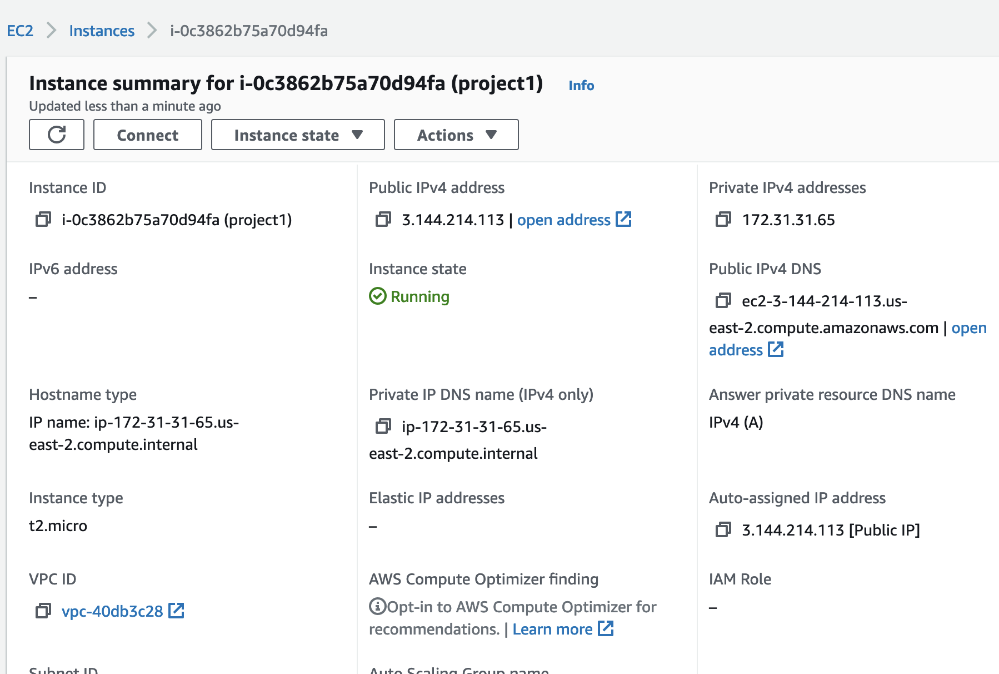

# LAMP Stack Implementation on AWS

LAMP is a technology stark made up of the following stacks:

- Linux
- Apache
- MySQL
- Php, or Python, or Perl

## Step 0

Spin up a new AWS EC2 instance of t2.micro family with Ubuntu Server 20.04 LTS (HVM)

