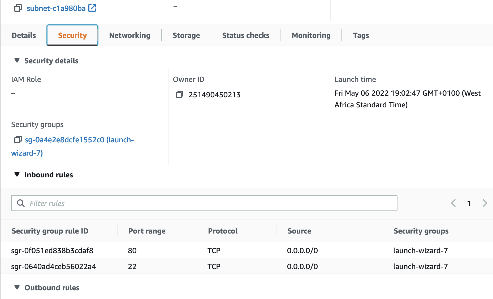
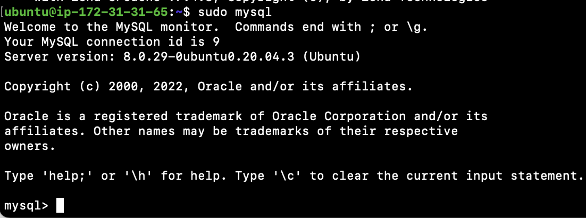
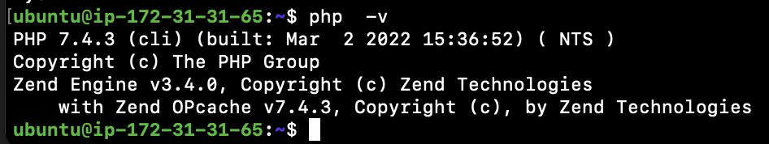

# LAMP Stack Implementation on AWS

LAMP is a technology stark made up of the following stacks:

- Linux
- Apache
- MySQL
- Php, or Python, or Perl

## Step 0 - Preparing Prerequisite

- Create a new AWS EC2 instance of t2.micro family with Ubuntu Server 20.04 LTS (HVM)
  

- Download the private key (.pem) file to your local machine
  

- Change to the downloaded key directory

  ```
  cd ~/Downloads
  ```

- Change file permission to 0400

  ```
  sudo chmod 0400 *private-key-file*.pem
  ```

- Connect to the instance by running
  ```
  ssh -i private-key-file.pem ubuntu@Public-IP-address
  ```

## Step 1 - Install Apache and Update the Firewall

- Install Apache using ubuntu's package manager "apt"

  ```
  #update a list of packages in package manager
  sudo apt update

  #run apache2 package installation
  sudo apt install apache2
  ```

- Verify that Apache is running as a service

  ```
  sudo systemctl status apache2
  ```

- Open inbound connections to port 80 from EC2 security group configuration
  

- Open a browser and point to the url
  ```
  http://public-ip-address
  ```

## Step 2 - Install MySQL

- Use 'apt' to install mysql
  ```
  sudo apt install mysql-server
  ```
- Test if you are able to login
  ```
  sudo mysql
  ```
  
- To exist mysql type 'exit':
  ```
  mysql> exit
  ```

## Step 3 - Install PHP

- Install PHP packages
  ```
  sudo apt install php libapache2-mod-php php-mysql
  ```
- After install, confirm PHP version
  ```
  php -v
  ```
  

## Step 4 - Create Virtualhosts using Apache

Apache on Ubuntu 20.04 has one server block enabled by default that is configured to serve documents from the **/var/www/html** directory. We will add our own directory for our domain called **projectlamp**

- Create directory for projectlamp
  ```
  sudo mkdir /var/www/projectlamp
  ```
- Assign directory ownership to system user
  ```
  sudo chown -R $USER:$USER /var/www/projectlamp
  ```
- create a new configuration file in Apache **sites-available** directory
  ```
  sudo vi /etc/apache2/sites-available/projectlamp.conf
  ```
- Paste the configurations into the file
  ```
  $\gt$VirtualHost *:80$\lt$
    ServerName projectlamp
    ServerAlias www.projectlamp
    ServerAdmin webmaster@localhost
    DocumentRoot /var/www/projectlamp
    ErrorLog ${APACHE_LOG_DIR}/error.log
    CustomLog ${APACHE_LOG_DIR}/access.log combined
  $<$VirtualHost$>$
  ```
- Save and exit
- Use **a2ensite** command to enable the new virtual host
  ```
  sudo a2ensite projectlamp
  ```
- disable Apache\’s default website
  ```
  sudo a2dissite 000-default
  ```
- Check that the configuration file does not contain any errors
  ```
  sudo apache2ctl configtest
  ```
- Reload Apache
  ```
  sudo systemctl reload apache2
  ```
- Create an index file in the web directory
  ```
  sudo echo 'Hello LAMP from hostname' $(curl -s http://169.254.169.254/latest/meta-data/public-hostname) 'with public IP' $(curl -s http://169.254.169.254/latest/meta-data/public-ipv4) > /var/www/projectlamp/index.html
  ```
- Access the website on your browser
  ```
  https://public-ip-address:80
  ```
