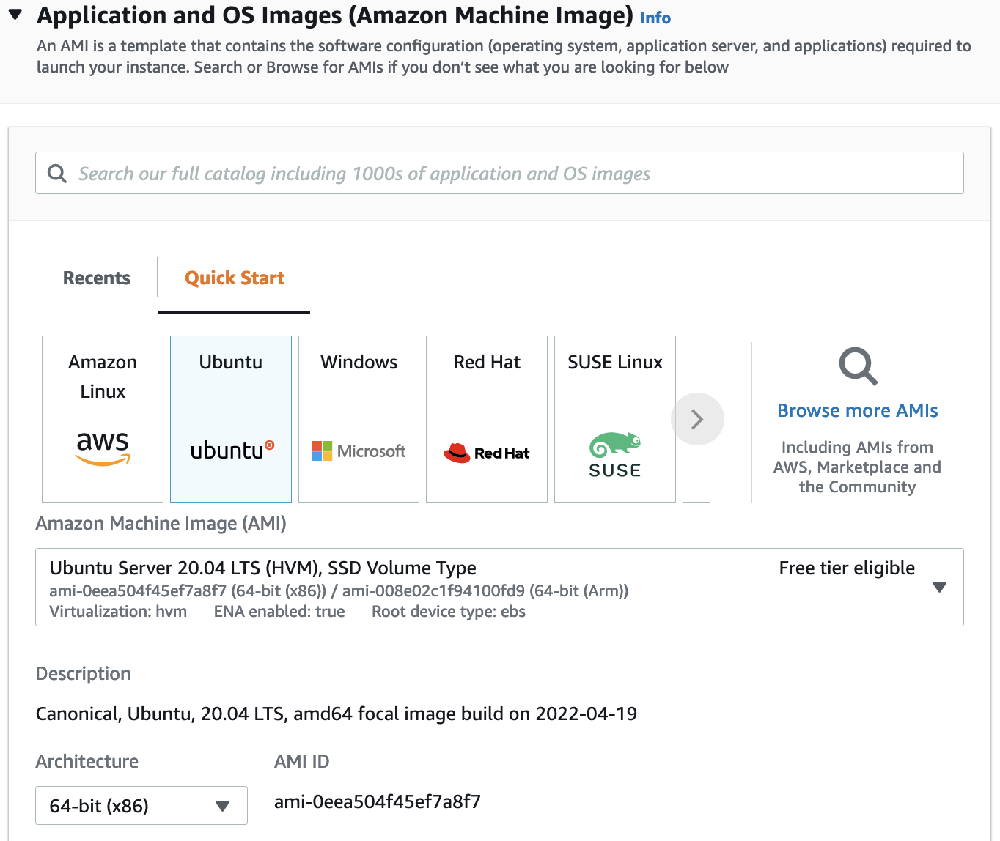
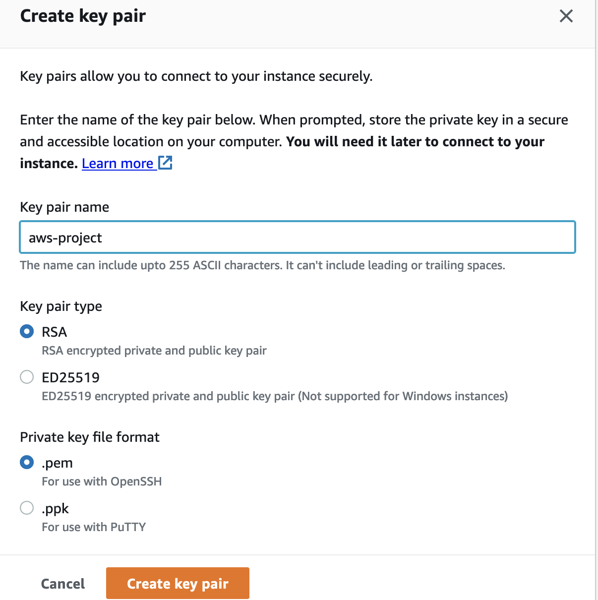

# LAMP Stack Implementation on AWS

LAMP is a technology stark made up of the following stacks:

- Linux
- Apache
- MySQL
- Php, or Python, or Perl

## Step 0 - Preparing Prerequisite

- Create a new AWS EC2 instance of t2.micro family with Ubuntu Server 20.04 LTS (HVM)
  

- Download the private key (.pem) file to your local machine
  

- Change to the downloaded key directory
  '''cd ~/Downloads'''

- Change file permission to 0400
  '''sudo chmod 0400 private-key-file.pem'''

- Connect to the instance by running
  '''ssh -i private-key-file.pem ubuntu@Public-IP-address'''
