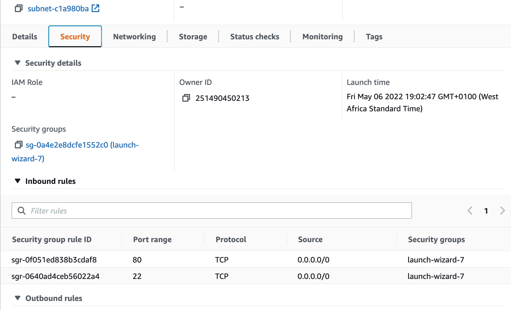
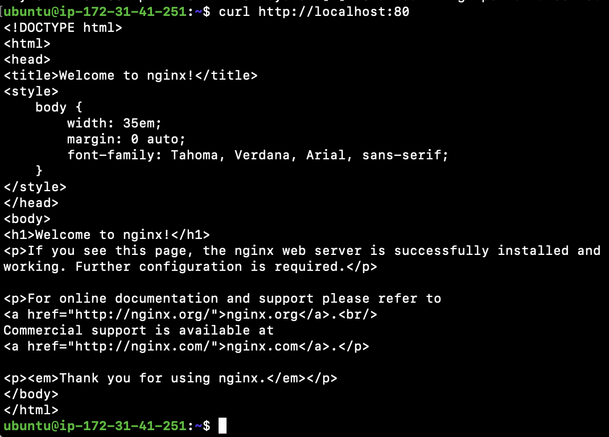
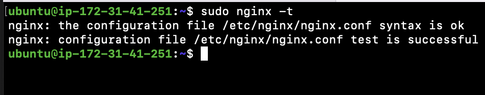
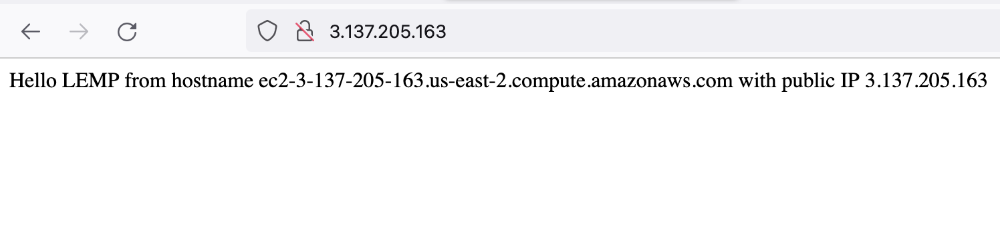
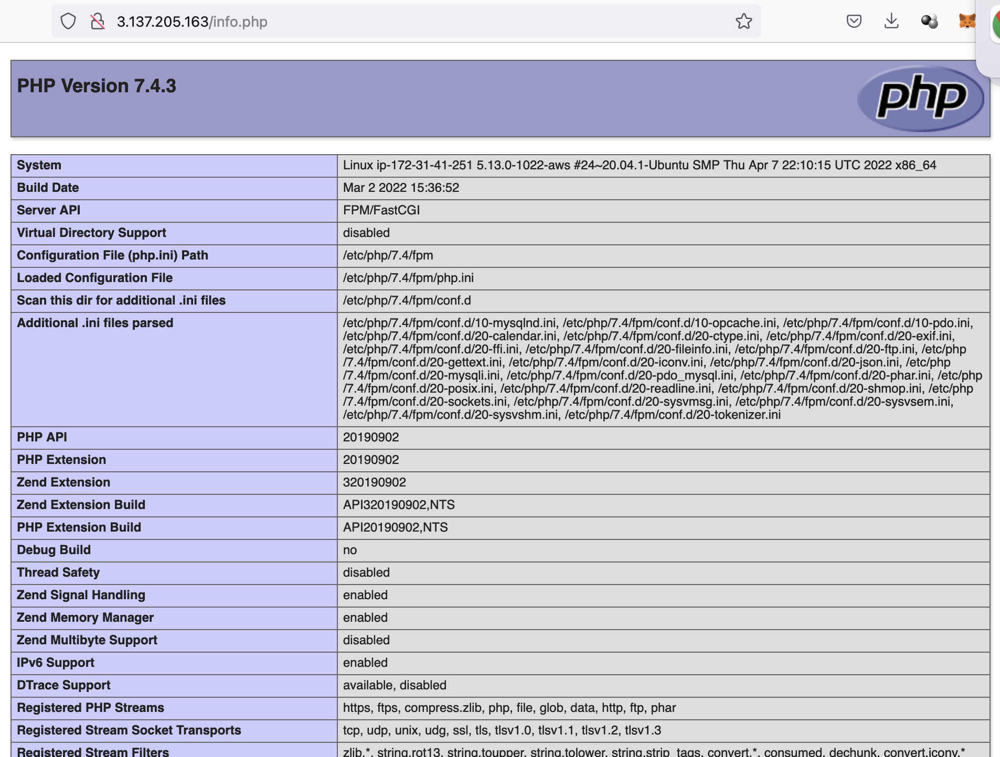

# LEMP Stack Implementation on AWS

LEMP is a technology stark made up of the following stacks:

- Linux
- Nginx
- MySQL
- Php, or Python, or Perl

## Step 0 - Preparing Prerequisite

- Create a new AWS EC2 instance of t2.micro family with Ubuntu Server 20.04 LTS (HVM)
  

- Download the private key (.pem) file to your local machine
  

- Change to the downloaded key directory

  ```
  cd ~/Downloads
  ```

- Change file permission to 0400

  ```
  sudo chmod 0400 *private-key-file*.pem
  ```

- Connect to the instance by running
  ```
  ssh -i private-key-file.pem ubuntu@Public-IP-address
  ```

## Step 1 - Install Nginx Webserver

- Install Nginx using ubuntu's package manager "apt"

  ```
  #update a list of packages in package manager
  sudo apt update

  #Install Nginx
  sudo apt install nginx -y
  ```

- Verify that Nginx is running as a service

  ```
  sudo systemctl status nginx
  ```

- Open inbound connections to port 80 from EC2 security group configuration
  

- Access the webpage locally

  ```
  curl http://localhost:80
  ```

  

- Open a browser and point to the url
  ```
  http://public-ip-address
  ```
  

## Step 2 - Install MySQL

- Use 'apt' to install mysql
  ```
  sudo apt install mysql-server -y
  ```
- Test if you are able to login
  ```
  sudo mysql
  ```
  
- To exist mysql type 'exit':
  ```
  mysql> exit
  ```

## Step 3 - Install PHP

Unlike Apache that embeds the PHP interpreter in each request, Nginx requires an external program to handle PHP processing and act as a bridge between the PHP interpreter itself and the web server. **php-fpm** processes PHP requests. And **php-mysql** a PHP module allows PHP to communicate with MySQL-based databases.

- Install PHP packages
  ```
  sudo apt install php-fpm php-mysql -y
  ```
- After install, confirm PHP version
  ```
  php -v
  ```
  

## Step 4 - Configure Nginx to use PHP Processor

On Ubuntu 20.04, Nginx has one server block enabled by default and is configured to serve documents out of a directory at **/var/www/html**. While this works well for a single site, it can become difficult to manage if you are hosting multiple sites. Instead of modifying **/var/www/html**, we’ll create a directory structure within **/var/www** for the your_domain website, leaving **/var/www/html** in place as the default directory to be served if a client request does not match any other sites.

- Create the root web directory for your_domain
  ```
  sudo mkdir /var/www/projectlemp
  ```
- Assign directory ownership to system user
  ```
  sudo chown -R $USER:$USER /var/www/projectlamp
  ```
- create a new configuration file in Nginx\'s **sites-available** directory
  ```
  sudo vi /etc/nginx/sites-available/projectlemp.conf
  ```
- Paste the configurations into the file

  ```
  server {
    listen 80;
    server_name projectlemp www.projectlemp;
    root /var/www/projectlemp;

    index index.html index.htm index.php;

    location / {
        try_files $uri $uri/ =404;
    }

    location ~ \.php$ {
        include snippets/fastcgi-php.conf;
        fastcgi_pass unix:/var/run/php/php7.4-fpm.sock;
     }

    location ~ /\.ht {
        deny all;
    }

  }
  ```

- Save and exit
- Activate the configuration by linking to the config file from Nginx\'s **sites-enabled** directory
  ```
  sudo ln -s /etc/nginx/sites-available/projectlemp /etc/nginx/sites-enabled/
  ```
  This will tell Nginx to use the configuration next time it is reloaded.

- Check that the configuration file does not contain any errors
  ```
  sudo nginx -t
  ```
  
- Disable default Nginx host that is currently configured to listen on port 80
  ```
  sudo unlink /etc/nginx/sites-enabled/default
  ```
- Reload Nginx
  ```
  
  ```
- Create an index file in the web directory
  ```
  sudo echo 'Hello LEMP from hostname' $(curl -s http://169.254.169.254/latest/meta-data/public-hostname) 'with public IP' $(curl -s http://169.254.169.254/latest/meta-data/public-ipv4) > /var/www/projectlemp/index.html
  ```
- Access the website on your browser

  ```
  https://public-ip-address:80
  ```

  

  ## Step 5 - Testing PHP with Nginx

  - create a test PHP file in the document root

  ```
  sudo vim /var/www/projectlemp/info.php
  ```
    - Add the following text, which is valid PHP code that will return information about the server.
    ```
    <?php
    phpinfo();
    ```
  - Save and exit
  - Visit the webpage through the browser
    ```
    http://`server_domain_or_IP`/info.php
    ```
    
