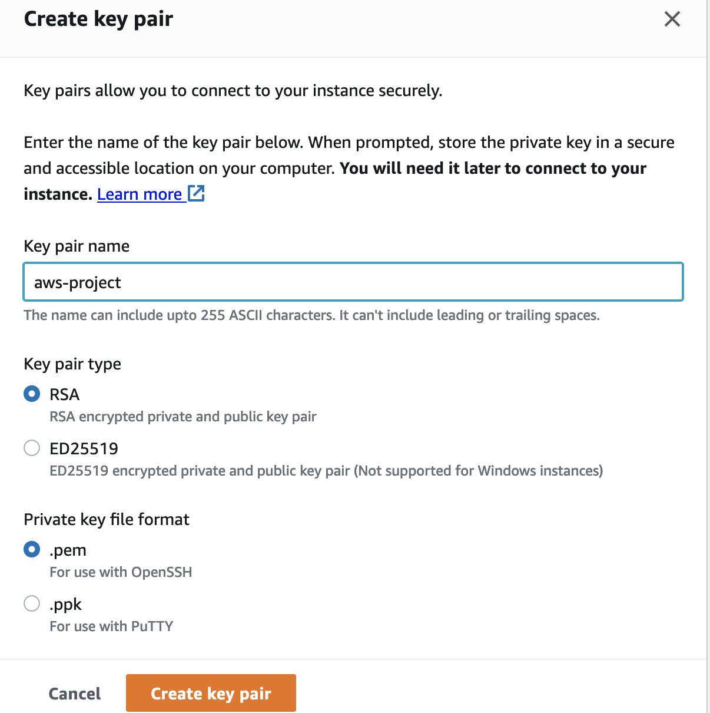

# MEAN Stack Implementation on AWS

**MEAN** Web stack consists of following components:

1. MongoDB: A document-based, No-SQL database used to store application data in a form of documents.
2. ExpressJS: A server side Web Application framework for Node.js.
3. Angula: A frontend framework that handles Client and Server requests
4. Node.js: A JavaScript runtime environment. It is used to run JavaScript on a machine rather than in a browser

## Step 0 - Preparing Prerequisite

- Create a new AWS EC2 instance of t2.micro family with Ubuntu Server 20.04 LTS (HVM)
  

- Download the private key (.pem) file to your local machine
  

- Change to the downloaded key directory

  ```
  cd ~/Downloads
  ```

- Change file permission to 0400

  ```
  sudo chmod 0400 *private-key-file*.pem
  ```

- Connect to the instance by running
  ```
  ssh -i private-key-file.pem ubuntu@Public-IP-address
  ```

## Step 1 - Install NodeJS

Node.js is used here to set up the Express routes and AngularJS controllers.

- Update ubuntu
  ```
  sudo apt update
  ```
- Upgrade ubuntu
  ```
  sudo apt upgrade
  ```
- Add certificates

  ```
  sudo apt -y install curl dirmngr apt-transport-https lsb-release ca-certificates

  curl -sL https://deb.nodesource.com/setup_12.x | sudo -E bash -
  ```

- Install NodeJS
  ```
  sudo apt install -y nodejs
  ```

## Step 2: Install MongoDB

MongoDB stores data in flexible, JSON-like documents. Fields in a database can vary from document to document and data structure can be changed over time. In this application, we are adding book records to MongoDB that contain book name, isbn number, author, and number of pages.
mages/WebConsole.gif

```
sudo apt-key adv --keyserver hkp://keyserver.ubuntu.com:80 --recv 0C49F3730359A14518585931BC711F9BA15703C6
```

```
echo "deb [ arch=amd64 ] https://repo.mongodb.org/apt/ubuntu trusty/mongodb-org/3.4 multiverse" | sudo tee /etc/apt/sources.list.d/mongodb-org-3.4.list
```

- Install MongoDB

  ```
  sudo apt install -y mongodb
  ```

- Start The server

  ```
  sudo service mongodb start
  ```

- Verify that the service is up and running

  ```
  sudo systemctl status mongodb
  ```

- Install **npm** - Node package manager.

  ```
  sudo apt install -y npm
  ```

- Install **body-parser** package

- The **body-parser** package helps to process JSON files passed in requests to the server.

  ```
  sudo npm install body-parser
  ```

- Create a folder named **Books**

  ```
  mkdir Books && cd Books
  ```

- In the Books directory, Initialize npm project

  ```
  npm init
  ```

- Add a file to it named server.js

  ```
  vi server.js
  ```

- Copy and paste the web server code below into the **server.js** file.

```
var express = require('express');
var bodyParser = require('body-parser');
var app = express();
app.use(express.static(__dirname + '/public'));
app.use(bodyParser.json());
require('./apps/routes')(app);
app.set('port', 3300);
app.listen(app.get('port'), function() {
    console.log('Server up: http://localhost:' + app.get('port'));
});
```

- # Step 3 - Install Express and set up routes to the server
- Express will pass book information to and from the MongoDB database
- Mongoose will establish a schema for the database to store data of the book register
  ```
  sudo npm install express mongoose
  ```
- In 'Books' folder, create a folder named apps
  ```
  mkdir apps && cd apps
  ```
- Create a file named routes.js
  ```
  vi routes.js
  ```
- Copy and paste the code below into routes.js

```
var Book = require('./models/book');
module.exports = function(app) {
  app.get('/book', function(req, res) {
    Book.find({}, function(err, result) {
      if ( err ) throw err;
      res.json(result);
    });
  });
  app.post('/book', function(req, res) {
    var book = new Book( {
      name:req.body.name,
      isbn:req.body.isbn,
      author:req.body.author,
      pages:req.body.pages
    });
    book.save(function(err, result) {
      if ( err ) throw err;
      res.json( {
        message:"Successfully added book",
        book:result
      });
    });
  });
  app.delete("/book/:isbn", function(req, res) {
    Book.findOneAndRemove(req.query, function(err, result) {
      if ( err ) throw err;
      res.json( {
        message: "Successfully deleted the book",
        book: result
      });
    });
  });
  var path = require('path');
  app.get('*', function(req, res) {
    res.sendfile(path.join(__dirname + '/public', 'index.html'));
  });
};
```

- In the **apps** folder, create a folder named **models**
  ```
  mkdir models && cd models
  ```
- Create a file named book.js
  ```
  vi book.js
  ```
- Copy and paste the code below into 'book.js'

```
var mongoose = require('mongoose');
var dbHost = 'mongodb://localhost:27017/test';
mongoose.connect(dbHost);
mongoose.connection;
mongoose.set('debug', true);
var bookSchema = mongoose.Schema( {
  name: String,
  isbn: {type: String, index: true},
  author: String,
  pages: Number
});
var Book = mongoose.model('Book', bookSchema);
module.exports = mongoose.model('Book', bookSchema);
```

## Step 4 - Access the routes with AngularJS

AngularJS provides a web framework for creating dynamic views in web applications. AngularJS will be used to connect the web page with Express and perform actions on the book register.

- Change the directory back to **Books**
  ```
  cd ../..
  ```
- Create a folder named **public**
  ```
  mkdir public && cd public
  ```
- Add a file named **script.js**
  ```
  vi script.js
  ```
- Copy and paste the Code below (controller configuration defined) into the **script.js file**.

```
var app = angular.module('myApp', []);
app.controller('myCtrl', function($scope, $http) {
  $http( {
    method: 'GET',
    url: '/book'
  }).then(function successCallback(response) {
    $scope.books = response.data;
  }, function errorCallback(response) {
    console.log('Error: ' + response);
  });
  $scope.del_book = function(book) {
    $http( {
      method: 'DELETE',
      url: '/book/:isbn',
      params: {'isbn': book.isbn}
    }).then(function successCallback(response) {
      console.log(response);
    }, function errorCallback(response) {
      console.log('Error: ' + response);
    });
  };
  $scope.add_book = function() {
    var body = '{ "name": "' + $scope.Name +
    '", "isbn": "' + $scope.Isbn +
    '", "author": "' + $scope.Author +
    '", "pages": "' + $scope.Pages + '" }';
    $http({
      method: 'POST',
      url: '/book',
      data: body
    }).then(function successCallback(response) {
      console.log(response);
    }, function errorCallback(response) {
      console.log('Error: ' + response);
    });
  };
});
```

- In **public** folder, create a file named **index.html**;
  ```
  vi index.html
  ```
- Cpoy and paste the code below into **index.html** file.

```
<!doctype html>
<html ng-app="myApp" ng-controller="myCtrl">
  <head>
    <script src="https://ajax.googleapis.com/ajax/libs/angularjs/1.6.4/angular.min.js"></script>
    <script src="script.js"></script>
  </head>
  <body>
    <div>
      <table>
        <tr>
          <td>Name:</td>
          <td><input type="text" ng-model="Name"></td>
        </tr>
        <tr>
          <td>Isbn:</td>
          <td><input type="text" ng-model="Isbn"></td>
        </tr>
        <tr>
          <td>Author:</td>
          <td><input type="text" ng-model="Author"></td>
        </tr>
        <tr>
          <td>Pages:</td>
          <td><input type="number" ng-model="Pages"></td>
        </tr>
      </table>
      <button ng-click="add_book()">Add</button>
    </div>
    <hr>
    <div>
      <table>
        <tr>
          <th>Name</th>
          <th>Isbn</th>
          <th>Author</th>
          <th>Pages</th>

        </tr>
        <tr ng-repeat="book in books">
          <td>{{book.name}}</td>
          <td>{{book.isbn}}</td>
          <td>{{book.author}}</td>
          <td>{{book.pages}}</td>

          <td><input type="button" value="Delete" data-ng-click="del_book(book)"></td>
        </tr>
      </table>
    </div>
  </body>
</html>
```

- Change the directory back up to Books
  ```
  cd ..
  ```
- Start the server
  ```
  node server.js
  ```
  

The server is now up and running via port 3300. Launch a separate Putty or SSH console to test what curl command returns locally.

```
curl -s http://localhost:3300
```


Open TCP port 3300 in the Security tab of the AWS EC2 Instance.


- Access the Books App over the browser
  ```
  http://public-ip-address:3300
  ```
  
