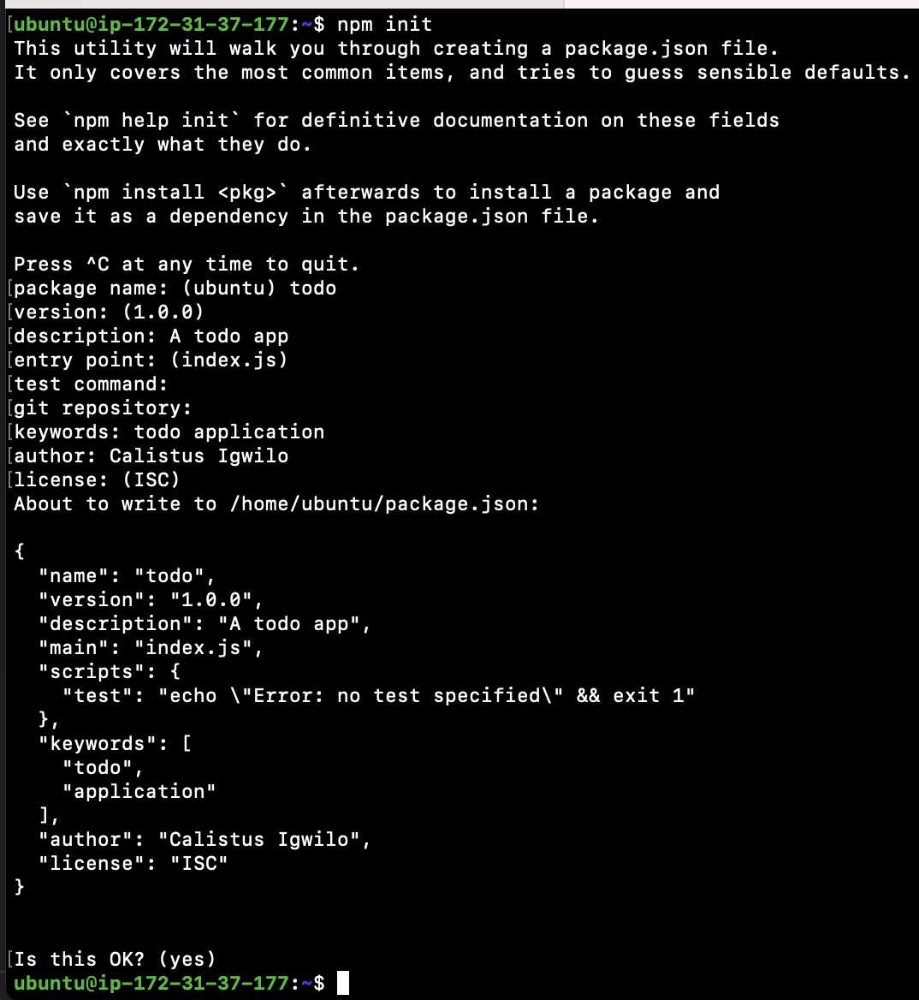
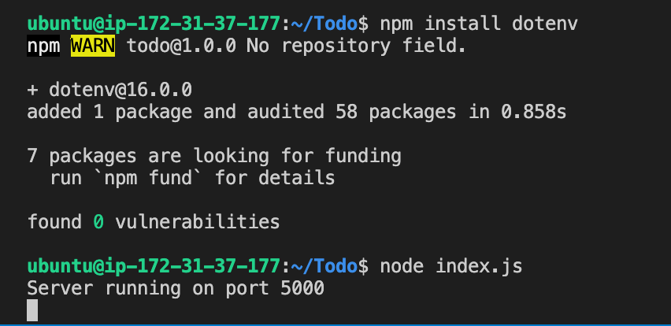
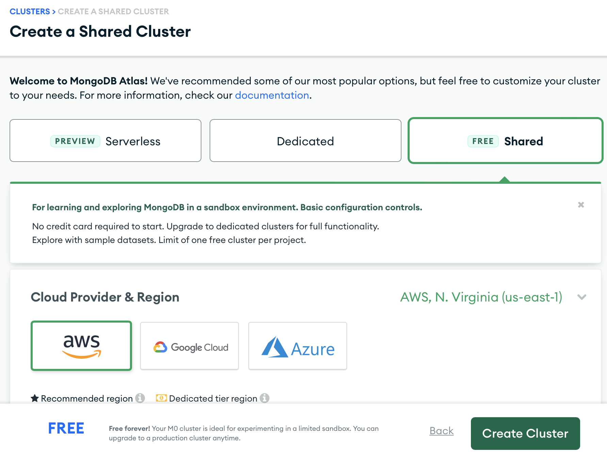
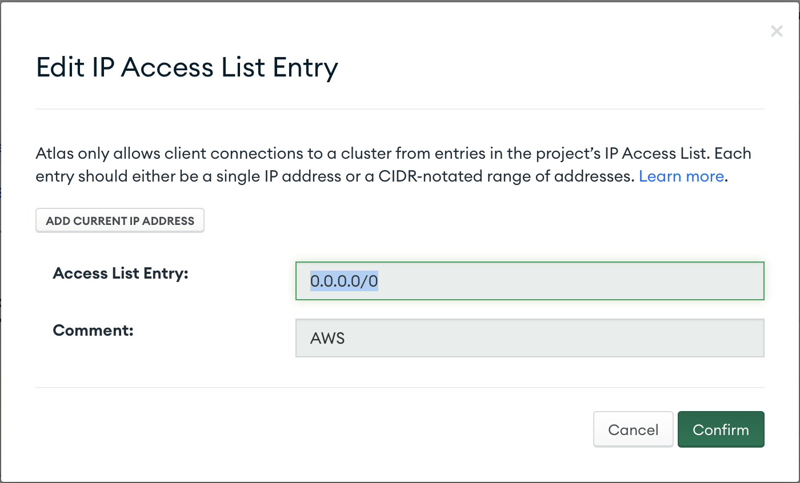
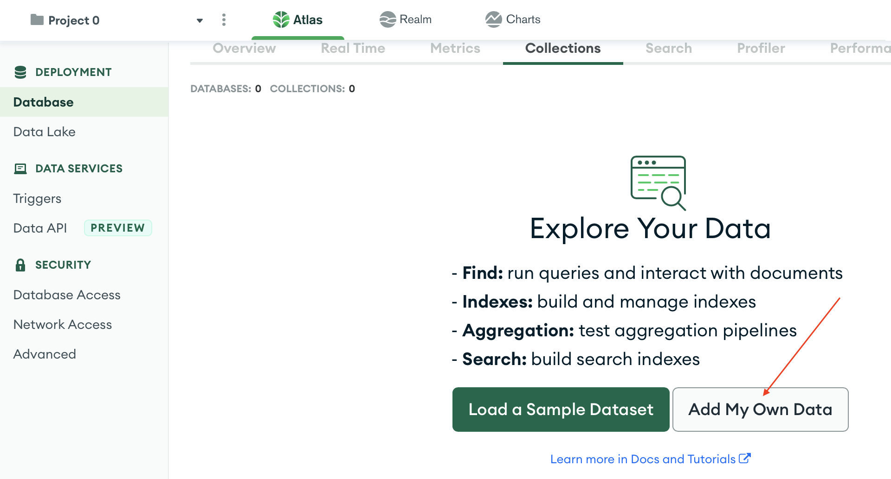
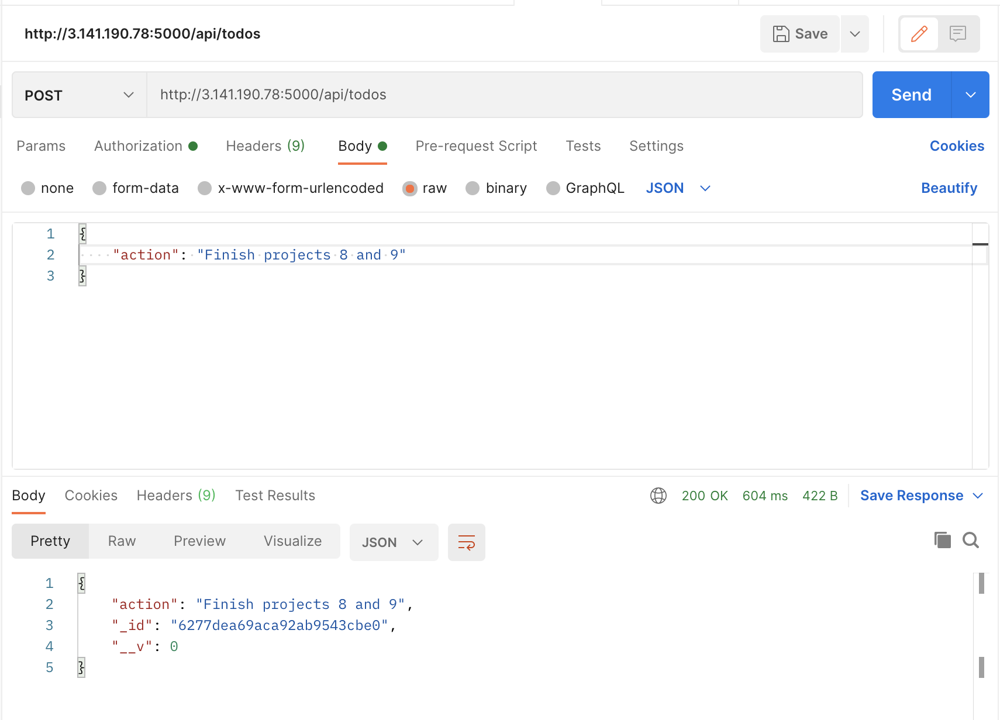
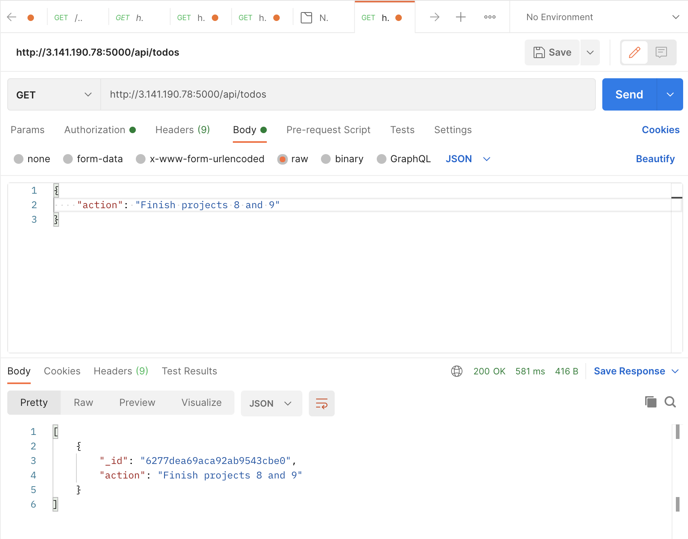
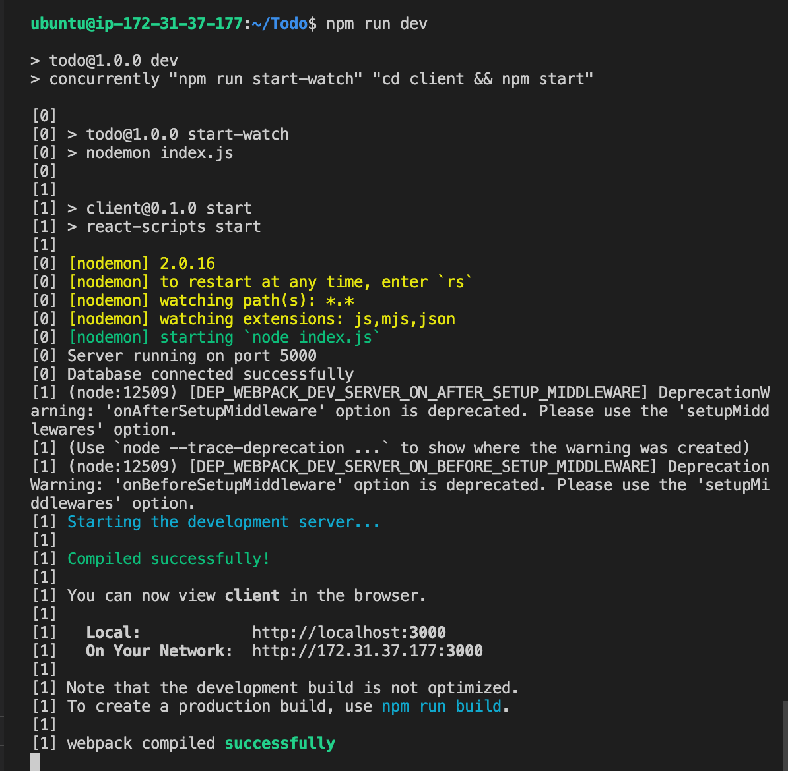
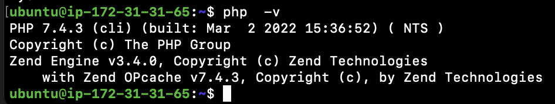

# MERN Stack Implementation on AWS

**MERN** Web stack consists of following components:

1. MongoDB: A document-based, No-SQL database used to store application data in a form of documents.
2. ExpressJS: A server side Web Application framework for Node.js.
3. ReactJS: A frontend framework developed by Facebook. It is based on JavaScript, used to build User Interface (UI) components.
4. Node.js: A JavaScript runtime environment. It is used to run JavaScript on a machine rather than in a browser
   

## Step 0 - Preparing Prerequisite

- Create a new AWS EC2 instance of t2.micro family with Ubuntu Server 20.04 LTS (HVM)
  

- Download the private key (.pem) file to your local machine
  

- Change to the downloaded key directory

  ```
  cd ~/Downloads
  ```

- Change file permission to 0400

  ```
  sudo chmod 0400 *private-key-file*.pem
  ```

- Connect to the instance by running
  ```
  ssh -i private-key-file.pem ubuntu@Public-IP-address
  ```

## Step 1 - Backend Configuration

- Update ubuntu
  ```
  sudo apt update
  ```
- Upgrade ubuntu
  ```
  sudo apt upgrade -y
  ```
- Get the location of Node.js software from Ubuntu repositories.
  ```
  curl -sL https://deb.nodesource.com/setup_12.x | sudo -E bash -
  ```
  ### Install Node.js on the server
- Install Node.js with the command below
  ```
  sudo apt-get install -y nodejs
  ```
- Verify node install
  ```
  node -v
  ```
- Verify npm install
  ```
  npm -v
  ```
  

### Application Code Setup

- Create a new directory for the To-Do project
  ```
  mkdir Todo
  ```
- Change to directory Todo
  ```
  cd Todo
  ```
- Initialize project with **npm init**

  ```
  npm init
  ```

  

- ### Install ExpressJS
  ```
  npm install express
  ```
- Create index.js file
  ```
  touch index.js
  ```
- Install the dotenv module
  ```
  npm install dotenv
  ```
- Open the index.js file
  ```
  vi index.js
  ```
- Type the code below into it and save

  ```
  const express = require('express');
  require('dotenv').config();

  const app = express();

  const port = process.env.PORT || 5000;

  app.use((req, res, next) => {
  res.header("Access-Control-Allow-Origin", "\*");
  res.header("Access-Control-Allow-Headers", "Origin, X-Requested-With, Content-Type, Accept");
  next();
  });

  app.use((req, res, next) => {
  res.send('Welcome to Express');
  });

  app.listen(port, () => {
  console.log(`Server running on port ${port}`)
  });
  ```

- Save and exit

- Start the Server

  ```
  node index.js
  ```

  

- Open TCP port 5000 on the EC2 Security group
  

- Access the website through port 5000

  ```
  http://<PublicIP-or-PublicDNS>:5000
  ```

  

- ### Routes

  There are three actions that our To-Do application needs to be able to do:

  1.  Create a new task
  2.  Display list of all tasks
  3.  Delete a completed task
      Each task will be associated with some particular endpoint and will use different standard HTTP request methods: POST, GET, DELETE.

  Each task needs a route that will define various endpoints that the To-do app will depend on.

- Create directory to hold routes
  ```
  mkdir routes
  ```
- Change directory to routes folder.
  ```
  cd routes
  ```
- Create api.js file
  ```
  touch api.js
  ```
- Open the api.js file
  ```
  vim api.js
  ```
- Copy the below code into the file

  ```
  const express = require ('express');
  const router = express.Router();

  router.get('/todos', (req, res, next) => {

  });

  router.post('/todos', (req, res, next) => {

  });

  router.delete('/todos/:id', (req, res, next) => {

  })

  module.exports = router;
  ```

### Models

A model is at the heart of JavaScript based applications, and it is what makes it interactive.

Models will be used to define the database schema . This is important so that we will be able to define the fields stored in each Mongodb document.

The Schema is a blueprint of how the database will be constructed, including other data fields that may not be required to be stored in the database. These are known as virtual properties

To create a Schema and a model, install mongoose which is a Node.js package that makes working with mongodb easier.

- Change directory back to Todo folder with cd .. and install Mongoose
  ```
  npm install mongoose
  ```
- Create a new folder models :
  ```
  mkdir models
  ```
- Change directory into the newly created models folder with

  ```
  cd models
  ```

- Inside the models folder, create a todo.js file
  ```
  touch todo.js
  ```
- Open the file created with **vim todo.js** and paste the code below into the file

  ```
  const mongoose = require('mongoose');
  const Schema = mongoose.Schema;

  //create schema for todo
  const TodoSchema = new Schema({
  action: {
  type: String,
  required: [true, 'The todo text field is required']
  }
  })

  //create model for todo
  const Todo = mongoose.model('todo', TodoSchema);

  module.exports = Todo;
  ```

- Save and quit
- In Routes directory, open **api.js** with **vi api.js**, delete the code inside with **:%d** command and paste the code below into it. Save and exit

```
const express = require ('express');
const router = express.Router();
const Todo = require('../models/todo');

router.get('/todos', (req, res, next) => {

//this will return all the data, exposing only the id and action field to the client
Todo.find({}, 'action')
.then(data => res.json(data))
.catch(next)
});

router.post('/todos', (req, res, next) => {
if(req.body.action){
Todo.create(req.body)
.then(data => res.json(data))
.catch(next)
}else {
res.json({
error: "The input field is empty"
})
}
});

router.delete('/todos/:id', (req, res, next) => {
Todo.findOneAndDelete({"_id": req.params.id})
.then(data => res.json(data))
.catch(next)
})

module.exports = router;
```

### MongoDB Database

mLab provides MongoDB database as a service solution (DBaaS), so to make life easy, sign up for a shared clusters free account, which is ideal for this use case. https://www.mongodb.com/atlas-signup-from-mlab Follow the sign up process, select AWS as the cloud provider.


Complete the "Get started" checklist. On Network settings, enable "allow access from anywhere"


- Create a MongoDB database and collection inside mLab
  On the database tab, click on "Browse Collections"
  

  Choose the "Add my own data" option
  

- Create **.env** file in the **Todo** directory
  ```
  touch .env
  vi .env
  ```
- Paste the connection string in the file

  ```
  DB = 'mongodb+srv://<username>:<password>@<network-address>/<dbname>?retryWrites=true&w=majority'
  ```

  Update **username**, **password**, **network-address** and **database** according to the database setup

- Update the **index.js** to reflect the use of **.env** to enable Node.js connect to the database.

```
vi indext.js
```

- Delete previous contents and replace with

```
const express = require('express');
const bodyParser = require('body-parser');
const mongoose = require('mongoose');
const routes = require('./routes/api');
const path = require('path');
require('dotenv').config();

const app = express();

const port = process.env.PORT || 5000;

//connect to the database
mongoose.connect(process.env.DB, { useNewUrlParser: true, useUnifiedTopology: true })
.then(() => console.log(`Database connected successfully`))
.catch(err => console.log(err));

//since mongoose promise is depreciated, we overide it with node's promise
mongoose.Promise = global.Promise;

app.use((req, res, next) => {
res.header("Access-Control-Allow-Origin", "\*");
res.header("Access-Control-Allow-Headers", "Origin, X-Requested-With, Content-Type, Accept");
next();
});

app.use(bodyParser.json());

app.use('/api', routes);

app.use((err, req, res, next) => {
console.log(err);
next();
});

app.listen(port, () => {
console.log(`Server running on port ${port}`)
});
```

- Start the node server
  ```
  node index.js
  ```
  

### Test Backend Code without Frontend using RESTful API

- Open Postman, create a POST request to the API http://publicIP-or-PublicDNS:5000/api/todos. This request sends a new task to the To-Do list so the application could store it in the database.
  

- Create a GET request to the API on http://PublicIP-or-PublicDNS:5000/api/todos. This request retrieves all existing records from the To-do application
  

- Create a DELETE request to the API on http://PublicIP-or-PublicDNS:5000/api/todos. The DELETE request requires the record ID
  

## Step 2 - Frontend Creation
- Use the **create-react-app** command to scaffold the app, in the Todo directory
  ```
  npx create-react-app client
  ```
### Running React App
- Install **concurrently** used to run more than one command simultaneously from the same terminal
  ```
  npm install concurrently --save-dev
  ```
- Install **nodemon**. used to run and monitor the server. If there is any change in the server code, nodemon will restart it automatically and load the new changes.
  ```
  npm install nodemon --save-dev
  ```
- In Todo folder open the **package.json** file. Change the highlighted part of the below screenshot and replace with the code below
  ```
  "scripts": {
  "start": "node index.js",
  "start-watch": "nodemon index.js",
  "dev": "concurrently \"npm run start-watch\" \"cd client && npm start\""
  },
  ```
  
### Configure proxy in jason.package
1. Change directory to 'client'
  ```
  cd client
  ```
2. Open the package.json file
  ```
  vi package.json
  ```
3. Add the key value pair in the package.json file **"proxy": "http://localhost:5000"**.
The whole purpose of adding the proxy configuration in number 3 above is to make it possible to access the application directly from the browser by simply calling the server url like http://localhost:5000 rather than always including the entire path like http://localhost:5000/api/todos

- In the **Todo** directory, run: 
  ```
  npm run dev
  ```
  

  The app should open and start running on localhost:3000
  NOTE: Open port 3000 on the AWS EC2 security group to be able to access the service.
- Access the React app through port 3000 on the public-ip-address
  ```
  http://public-ip-address:3000
  ```
  

### Creating React Components

  
  

  


- Go to 'components' directory
  ```
  cd src/components
  ```

- Create the ListTodo.js
 ```
 vi ListTodo.js
 ```

- In the ListTodo.js copy and paste the codes below
```
import React from 'react';

const ListTodo = ({ todos, deleteTodo }) => {

return (
<ul>
{
todos &&
todos.length > 0 ?
(
todos.map(todo => {
return (
<li key={todo._id} onClick={() => deleteTodo(todo._id)}>{todo.action}</li>
)
})
)
:
(
<li>No todo(s) left</li>
)
}
</ul&...
```

- Open inbound connections to port 80 from EC2 security group configuration
  

- Access the webpage locally

```

curl http://localhost:80

```


- Open a browser and point to the url

```

http://public-ip-address

```


## Step 2 - Install MySQL

- Use 'apt' to install mysql

```

sudo apt install mysql-server -y

```

- Test if you are able to login

```

sudo mysql

```


- To exist mysql type 'exit':

```

mysql> exit

```

## Step 3 - Install PHP

Unlike Apache that embeds the PHP interpreter in each request, Nginx requires an external program to handle PHP processing and act as a bridge between the PHP interpreter itself and the web server. **php-fpm** processes PHP requests. And **php-mysql** a PHP module allows PHP to communicate with MySQL-based databases.

- Install PHP packages

```

sudo apt install php-fpm php-mysql -y

```

- After install, confirm PHP version

```

php -v

```



## Step 4 - Configure Nginx to use PHP Processor

On Ubuntu 20.04, Nginx has one server block enabled by default and is configured to serve documents out of a directory at **/var/www/html**. While this works well for a single site, it can become difficult to manage if you are hosting multiple sites. Instead of modifying **/var/www/html**, we’ll create a directory structure within **/var/www** for the your_domain website, leaving **/var/www/html** in place as the default directory to be served if a client request does not match any other sites.

- Create the root web directory for your_domain

```

sudo mkdir /var/www/projectlemp

```

- Assign directory ownership to system user

```

sudo chown -R $USER:$USER /var/www/projectlamp

```

- create a new configuration file in Nginx\'s **sites-available** directory

```

sudo vi /etc/nginx/sites-available/projectlemp.conf

```

- Paste the configurations into the file

```

server {
listen 80;
server_name projectlemp www.projectlemp;
root /var/www/projectlemp;

    index index.html index.htm index.php;

    location / {
        try_files $uri $uri/ =404;
    }

    location ~ \.php$ {
        include snippets/fastcgi-php.conf;
        fastcgi_pass unix:/var/run/php/php7.4-fpm.sock;
     }

    location ~ /\.ht {
        deny all;
    }

}

```

- Save and exit
- Activate the configuration by linking to the config file from Nginx\'s **sites-enabled** directory

```

sudo ln -s /etc/nginx/sites-available/projectlemp /etc/nginx/sites-enabled/

```

This will tell Nginx to use the configuration next time it is reloaded.

- Check that the configuration file does not contain any errors

```

sudo nginx -t

```


- Disable default Nginx host that is currently configured to listen on port 80

```

sudo unlink /etc/nginx/sites-enabled/default

```

- Reload Nginx

```

```

- Create an index file in the web directory

```

sudo echo 'Hello LEMP from hostname' $(curl -s http://169.254.169.254/latest/meta-data/public-hostname) 'with public IP' $(curl -s http://169.254.169.254/latest/meta-data/public-ipv4) > /var/www/projectlemp/index.html

```

- Access the website on your browser

```

https://public-ip-address:80

```


## Step 5 - Testing PHP with Nginx

- create a test PHP file in the document root

```

sudo vim /var/www/projectlemp/info.php

```

- Add the following text, which is valid PHP code that will return information about the server.

```

  <?php
  phpinfo();
```

- Save and exit
- Visit the webpage through the browser
  ```
  http://`server_domain_or_IP`/info.php
  ```
  

## Retrieving data from MySQL database with PHP

Create a test database (DB) with simple "To do list" and configure access to it, so the Nginx website would be able to query data from the DB and display it

- Create a new user with the mysql_native_password authentication method in order to be able to connect to the MySQL database from PHP
- Connect to the database

```
sudo mysql
```


- Create a new database
  ```
  CREATE DATABASE example_database;
  ```
- Create a new user
  ```
  CREATE USER 'example_user'@'%' IDENTIFIED WITH mysql_native_password BY 'password';
  ```
- Grant the user permission over the example_database database
  ```
  GRANT ALL ON example_database.* TO 'example_user'@'%';
  ```
- Exit mysql shell
  ```
  exit
  ```
- Logon to mysql console using the new user credentials
  ```
  mysql -u example_user -p
  ```
  
- Confirm user has access to database

  ```
  SHOW DATABASES;
  ```

  

- Create a test table called **todo_list**
  ```
  CREATE TABLE example_database.todo_list (
    item_id INT AUTO_INCREMENT,
    content VARCHAR(255),
    PRIMARY KEY(item_id)
  );
  ```
- Insert a few rows of content in the test table

  ```
  INSERT INTO example_database.todo_list (content) VALUES ("My first important item");
  ```

- Confirm that the data was successfully saved to the table

  ```
  SELECT * FROM example_database.todo_list;
  ```

  

- Exit mysql console
  ```
  exit
  ```
- Create a PHP script that will connect to MySQL and query the contents

  ```
  vi /var/www/projectlemp/todo_list.php
  ```

  The following PHP script connects to the MySQL database and queries for the content of the todo_list table, displays the results in a list

  Copy this content into the todo_list.php script

  ```
  <?php
  $user = "example_user";
  $password = "password";
  $database = "example_database";
  $table = "todo_list";

  try {
    $db = new PDO("mysql:host=localhost;dbname=$database", $user, $password);
    echo "<h2>TODO</h2><ol>";
  foreach($db->query("SELECT content FROM $table") as $row) {
  echo "<li>" . $row['content'] . "</li>";
  }
  echo "</ol>";
  } catch (PDOException $e) {
    print "Error!: " . $e->getMessage() . "<br/>";
    die();
  }
  ```

- Save and quit
- Access the page through the web browser
  ```
  http://<Public_domain_or_IP>/todo_list.php
  ```
  
