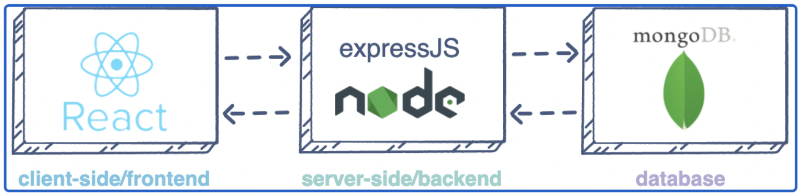
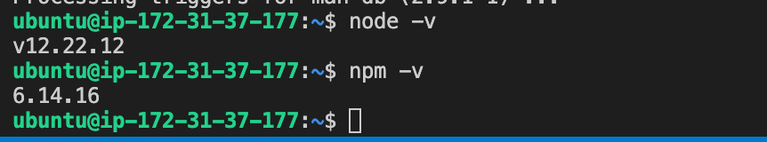
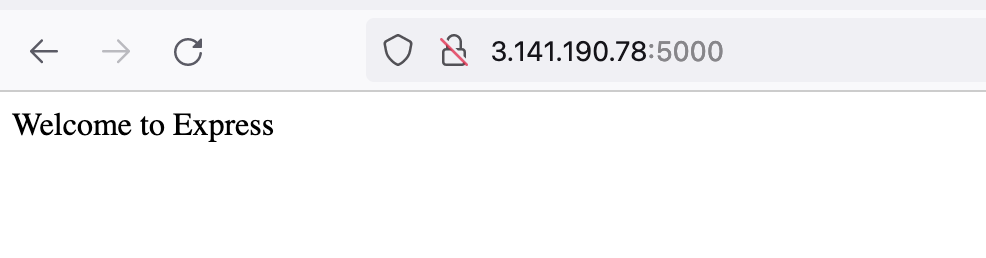
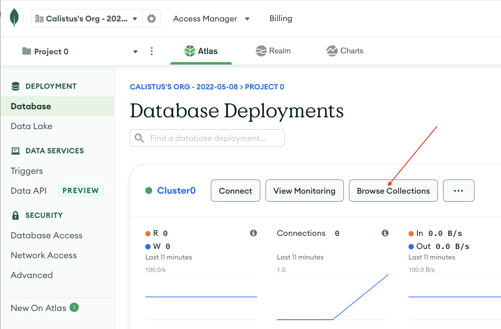
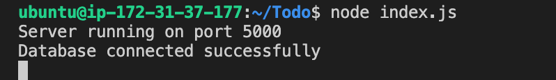
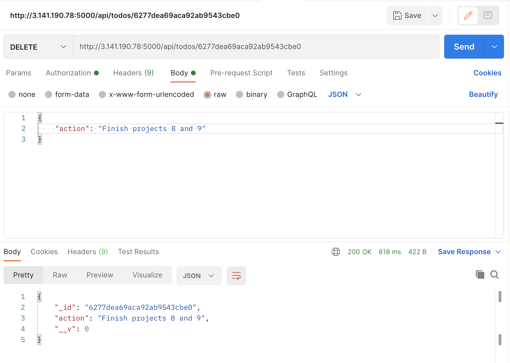
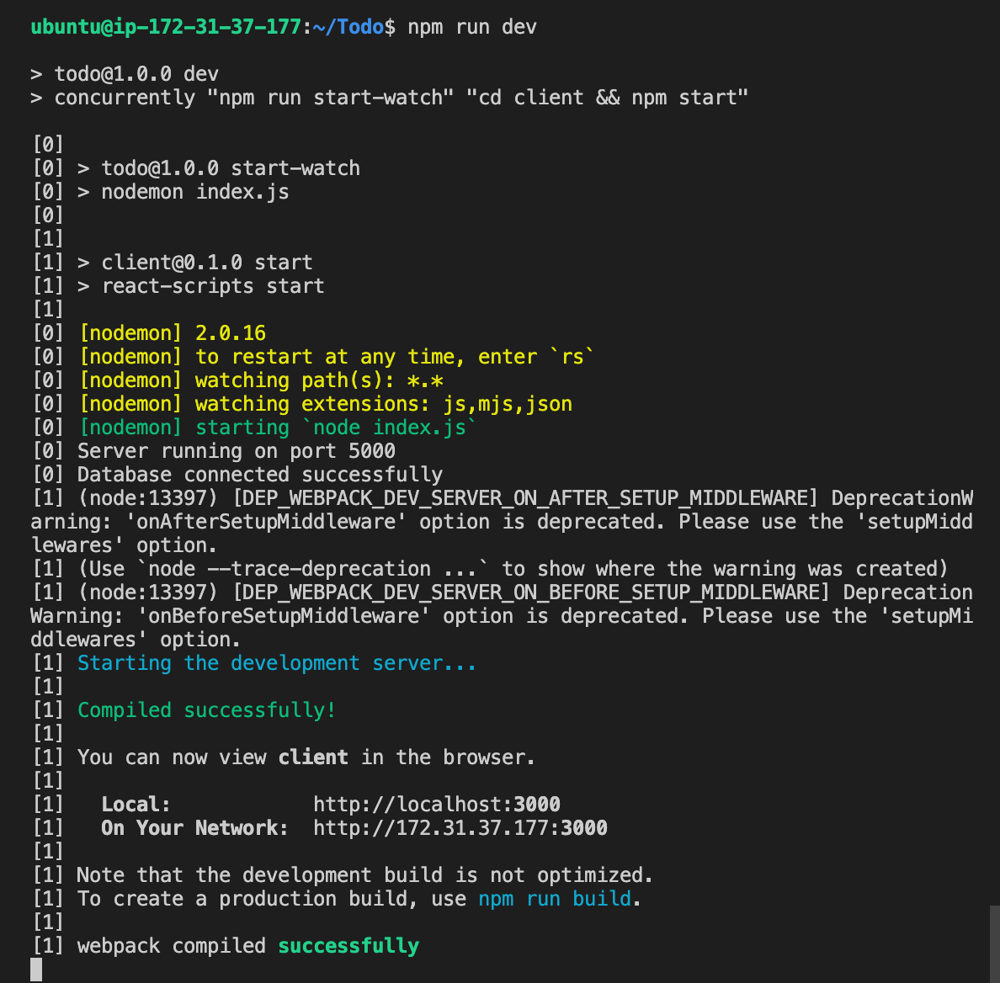
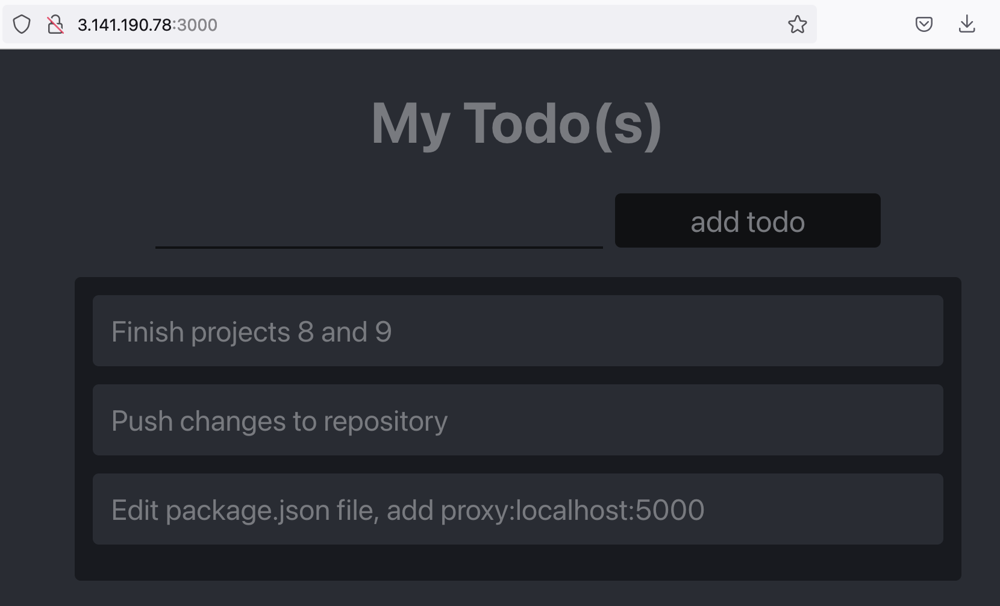

# MERN Stack Implementation on AWS

**MERN** Web stack consists of following components:

1. MongoDB: A document-based, No-SQL database used to store application data in a form of documents.
2. ExpressJS: A server side Web Application framework for Node.js.
3. ReactJS: A frontend framework developed by Facebook. It is based on JavaScript, used to build User Interface (UI) components.
4. Node.js: A JavaScript runtime environment. It is used to run JavaScript on a machine rather than in a browser
   

## Step 0 - Preparing Prerequisite

- Create a new AWS EC2 instance of t2.micro family with Ubuntu Server 20.04 LTS (HVM)
  

- Download the private key (.pem) file to your local machine
  

- Change to the downloaded key directory

  ```
  cd ~/Downloads
  ```

- Change file permission to 0400

  ```
  sudo chmod 0400 *private-key-file*.pem
  ```

- Connect to the instance by running
  ```
  ssh -i private-key-file.pem ubuntu@Public-IP-address
  ```

## Step 1 - Backend Configuration

- Update ubuntu
  ```
  sudo apt update
  ```
- Upgrade ubuntu
  ```
  sudo apt upgrade -y
  ```
- Get the location of Node.js software from Ubuntu repositories.
  ```
  curl -sL https://deb.nodesource.com/setup_12.x | sudo -E bash -
  ```
  ### Install Node.js on the server
- Install Node.js with the command below
  ```
  sudo apt-get install -y nodejs
  ```
- Verify node install
  ```
  node -v
  ```
- Verify npm install
  ```
  npm -v
  ```
  

### Application Code Setup

- Create a new directory for the To-Do project
  ```
  mkdir Todo
  ```
- Change to directory Todo
  ```
  cd Todo
  ```
- Initialize project with **npm init**

  ```
  npm init
  ```

  

- ### Install ExpressJS
  ```
  npm install express
  ```
- Create index.js file
  ```
  touch index.js
  ```
- Install the dotenv module
  ```
  npm install dotenv
  ```
- Open the index.js file
  ```
  vi index.js
  ```
- Type the code below into it and save

  ```
  const express = require('express');
  require('dotenv').config();

  const app = express();

  const port = process.env.PORT || 5000;

  app.use((req, res, next) => {
  res.header("Access-Control-Allow-Origin", "\*");
  res.header("Access-Control-Allow-Headers", "Origin, X-Requested-With, Content-Type, Accept");
  next();
  });

  app.use((req, res, next) => {
  res.send('Welcome to Express');
  });

  app.listen(port, () => {
  console.log(`Server running on port ${port}`)
  });
  ```

- Save and exit

- Start the Server

  ```
  node index.js
  ```

  

- Open TCP port 5000 on the EC2 Security group
  

- Access the website through port 5000

  ```
  http://<PublicIP-or-PublicDNS>:5000
  ```

  

- ### Routes

  There are three actions that our To-Do application needs to be able to do:

  1.  Create a new task
  2.  Display list of all tasks
  3.  Delete a completed task
      Each task will be associated with some particular endpoint and will use different standard HTTP request methods: POST, GET, DELETE.

  Each task needs a route that will define various endpoints that the To-do app will depend on.

- Create directory to hold routes
  ```
  mkdir routes
  ```
- Change directory to routes folder.
  ```
  cd routes
  ```
- Create api.js file
  ```
  touch api.js
  ```
- Open the api.js file
  ```
  vim api.js
  ```
- Copy the below code into the file

  ```
  const express = require ('express');
  const router = express.Router();

  router.get('/todos', (req, res, next) => {

  });

  router.post('/todos', (req, res, next) => {

  });

  router.delete('/todos/:id', (req, res, next) => {

  })

  module.exports = router;
  ```

### Models

A model is at the heart of JavaScript based applications, and it is what makes it interactive.

Models will be used to define the database schema . This is important so that we will be able to define the fields stored in each Mongodb document.

The Schema is a blueprint of how the database will be constructed, including other data fields that may not be required to be stored in the database. These are known as virtual properties

To create a Schema and a model, install mongoose which is a Node.js package that makes working with mongodb easier.

- Change directory back to Todo folder with cd .. and install Mongoose
  ```
  npm install mongoose
  ```
- Create a new folder models :
  ```
  mkdir models
  ```
- Change directory into the newly created models folder with

  ```
  cd models
  ```

- Inside the models folder, create a todo.js file
  ```
  touch todo.js
  ```
- Open the file created with **vim todo.js** and paste the code below into the file

  ```
  const mongoose = require('mongoose');
  const Schema = mongoose.Schema;

  //create schema for todo
  const TodoSchema = new Schema({
  action: {
  type: String,
  required: [true, 'The todo text field is required']
  }
  })

  //create model for todo
  const Todo = mongoose.model('todo', TodoSchema);

  module.exports = Todo;
  ```

- Save and quit
- In Routes directory, open **api.js** with **vi api.js**, delete the code inside with **:%d** command and paste the code below into it. Save and exit

```
const express = require ('express');
const router = express.Router();
const Todo = require('../models/todo');

router.get('/todos', (req, res, next) => {

//this will return all the data, exposing only the id and action field to the client
Todo.find({}, 'action')
.then(data => res.json(data))
.catch(next)
});

router.post('/todos', (req, res, next) => {
if(req.body.action){
Todo.create(req.body)
.then(data => res.json(data))
.catch(next)
}else {
res.json({
error: "The input field is empty"
})
}
});

router.delete('/todos/:id', (req, res, next) => {
Todo.findOneAndDelete({"_id": req.params.id})
.then(data => res.json(data))
.catch(next)
})

module.exports = router;
```

### MongoDB Database

mLab provides MongoDB database as a service solution (DBaaS), so to make life easy, sign up for a shared clusters free account, which is ideal for this use case. https://www.mongodb.com/atlas-signup-from-mlab Follow the sign up process, select AWS as the cloud provider.


Complete the "Get started" checklist. On Network settings, enable "allow access from anywhere"


- Create a MongoDB database and collection inside mLab
  On the database tab, click on "Browse Collections"
  

  Choose the "Add my own data" option
  

- Create **.env** file in the **Todo** directory
  ```
  touch .env
  vi .env
  ```
- Paste the connection string in the file

  ```
  DB = 'mongodb+srv://<username>:<password>@<network-address>/<dbname>?retryWrites=true&w=majority'
  ```

  Update **username**, **password**, **network-address** and **database** according to the database setup

- Update the **index.js** to reflect the use of **.env** to enable Node.js connect to the database.

```
vi indext.js
```

- Delete previous contents and replace with

```
const express = require('express');
const bodyParser = require('body-parser');
const mongoose = require('mongoose');
const routes = require('./routes/api');
const path = require('path');
require('dotenv').config();

const app = express();

const port = process.env.PORT || 5000;

//connect to the database
mongoose.connect(process.env.DB, { useNewUrlParser: true, useUnifiedTopology: true })
.then(() => console.log(`Database connected successfully`))
.catch(err => console.log(err));

//since mongoose promise is depreciated, we overide it with node's promise
mongoose.Promise = global.Promise;

app.use((req, res, next) => {
res.header("Access-Control-Allow-Origin", "\*");
res.header("Access-Control-Allow-Headers", "Origin, X-Requested-With, Content-Type, Accept");
next();
});

app.use(bodyParser.json());

app.use('/api', routes);

app.use((err, req, res, next) => {
console.log(err);
next();
});

app.listen(port, () => {
console.log(`Server running on port ${port}`)
});
```

- Start the node server
  ```
  node index.js
  ```
  

### Test Backend Code without Frontend using RESTful API

- Open Postman, create a POST request to the API http://publicIP-or-PublicDNS:5000/api/todos. This request sends a new task to the To-Do list so the application could store it in the database.
  

- Create a GET request to the API on http://PublicIP-or-PublicDNS:5000/api/todos. This request retrieves all existing records from the To-do application
  

- Create a DELETE request to the API on http://PublicIP-or-PublicDNS:5000/api/todos. The DELETE request requires the record ID
  

## Step 2 - Frontend Creation

- Use the **create-react-app** command to scaffold the app, in the Todo directory
  ```
  npx create-react-app client
  ```

### Running React App

- Install **concurrently** used to run more than one command simultaneously from the same terminal
  ```
  npm install concurrently --save-dev
  ```
- Install **nodemon**. used to run and monitor the server. If there is any change in the server code, nodemon will restart it automatically and load the new changes.
  ```
  npm install nodemon --save-dev
  ```
- In Todo folder open the **package.json** file. Change the highlighted part of the below screenshot and replace with the code below
  ```
  "scripts": {
  "start": "node index.js",
  "start-watch": "nodemon index.js",
  "dev": "concurrently \"npm run start-watch\" \"cd client && npm start\""
  },
  ```
  

### Configure proxy in jason.package

1. Change directory to 'client'

```
cd client
```

2. Open the package.json file

```
vi package.json
```

3. Add the key value pair in the package.json file **"proxy": "http://localhost:5000"**.
   The whole purpose of adding the proxy configuration in number 3 above is to make it possible to access the application directly from the browser by simply calling the server url like http://localhost:5000 rather than always including the entire path like http://localhost:5000/api/todos

- In the **Todo** directory, run:

  ```
  npm run dev
  ```

  

  The app should open and start running on localhost:3000
  NOTE: Open port 3000 on the AWS EC2 security group to be able to access the service.

- Access the React app through port 3000 on the public-ip-address
  ```
  http://public-ip-address:3000
  ```
  

### Creating React Components

The App will have two stateful components and one stateless component

- From the Todo directory run
  ```
  cd client
  ```
- Change to the src directory
  ```
  cd src
  ```
- In the src directory create another directory called components
  ```
  mkdir components
  ```
- change to the components directory
  ```
  cd components
  ```
- In components directory create three files Input.js, ListTodo.js and Todo.js.
  ```
  touch Input.js ListTodo.js Todo.js
  ```
- Open Input.js file
  ```
  vi Input.js
  ```
- Copy and paste the codes below

```
import React, { Component } from 'react';
import axios from 'axios';

class Input extends Component {

state = {
action: ""
}

addTodo = () => {
const task = {action: this.state.action}

    if(task.action && task.action.length > 0){
      axios.post('/api/todos', task)
        .then(res => {
          if(res.data){
            this.props.getTodos();
            this.setState({action: ""})
          }
        })
        .catch(err => console.log(err))
    }else {
      console.log('input field required')
    }

}

handleChange = (e) => {
this.setState({
action: e.target.value
})
}

render() {
let { action } = this.state;
return (
<div>
<input type="text" onChange={this.handleChange} value={action} />
<button onClick={this.addTodo}>add todo</button>
</div>
)
}
}

export default Input
```

To make use of **Axios**, which is a Promise based HTTP client for the browser and node.js, cd into client directory client and run yarn add axios or npm install axios.

- Go to the src folder
  ```
  cd ..
  ```
- Go to clients folder
  ```
  cd ..
  ```
- Install Axios
  ``
  npm install axios

  ```

  ```

- Go to 'components' directory

  ```
  cd src/components
  ```

- Open the ListTodo.js file

```
vi ListTodo.js
```

- In the **ListTodo.js** copy and paste the codes below

```
import React from 'react';

const ListTodo = ({ todos, deleteTodo }) => {

return (
<ul>
{
todos &&
todos.length > 0 ?
(
todos.map(todo => {
return (
<li key={todo._id} onClick={() => deleteTodo(todo._id)}>{todo.action}</li>
)
})
)
:
(
<li>No todo(s) left</li>
)
}
</ul>
)
}

export default ListTodo
```

- In the Todo.js file, write the following code

```
import React, {Component} from 'react';
import axios from 'axios';

import Input from './Input';
import ListTodo from './ListTodo';

class Todo extends Component {

state = {
todos: []
}

componentDidMount(){
this.getTodos();
}

getTodos = () => {
axios.get('/api/todos')
.then(res => {
if(res.data){
this.setState({
todos: res.data
})
}
})
.catch(err => console.log(err))
}

deleteTodo = (id) => {

    axios.delete(`/api/todos/${id}`)
      .then(res => {
        if(res.data){
          this.getTodos()
        }
      })
      .catch(err => console.log(err))

}

render() {
let { todos } = this.state;

    return(
      <div>
        <h1>My Todo(s)</h1>
        <Input getTodos={this.getTodos}/>
        <ListTodo todos={todos} deleteTodo={this.deleteTodo}/>
      </div>
    )

}
}

export default Todo;
```

Adjust the **App.js**

- Move to the src folder
  ```
  cd ..
  ```
- In the src folder, run
  ```
  vi App.js
  ```
- Copy and paste the code below into it

```
import React from 'react';

import Todo from './components/Todo';
import './App.css';

const App = () => {
return (
<div className="App">
<Todo />
</div>
);
}

export default App;
```

Save and exit the editor.

- In the src directory open the App.css

  ```
  vi App.css
  ```

- Paste the following code into App.css:

```
.App {
text-align: center;
font-size: calc(10px + 2vmin);
width: 60%;
margin-left: auto;
margin-right: auto;
}

input {
height: 40px;
width: 50%;
border: none;
border-bottom: 2px #101113 solid;
background: none;
font-size: 1.5rem;
color: #787a80;
}

input:focus {
outline: none;
}

button {
width: 25%;
height: 45px;
border: none;
margin-left: 10px;
font-size: 25px;
background: #101113;
border-radius: 5px;
color: #787a80;
cursor: pointer;
}

button:focus {
outline: none;
}

ul {
list-style: none;
text-align: left;
padding: 15px;
background: #171a1f;
border-radius: 5px;
}

li {
padding: 15px;
font-size: 1.5rem;
margin-bottom: 15px;
background: #282c34;
border-radius: 5px;
overflow-wrap: break-word;
cursor: pointer;
}

@media only screen and (min-width: 300px) {
.App {
width: 80%;
}

input {
width: 100%
}

button {
width: 100%;
margin-top: 15px;
margin-left: 0;
}
}

@media only screen and (min-width: 640px) {
.App {
width: 60%;
}

input {
width: 50%;
}

button {
width: 30%;
margin-left: 10px;
margin-top: 0;
}
}
```

- Save and exit

- In the src directory open the index.css
  ```
  vim index.css
  ```
- Copy and paste the code below:

```
body {
margin: 0;
padding: 0;
font-family: -apple-system, BlinkMacSystemFont, "Segoe UI", "Roboto", "Oxygen",
"Ubuntu", "Cantarell", "Fira Sans", "Droid Sans", "Helvetica Neue",
sans-serif;
-webkit-font-smoothing: antialiased;
-moz-osx-font-smoothing: grayscale;
box-sizing: border-box;
background-color: #282c34;
color: #787a80;
}

code {
font-family: source-code-pro, Menlo, Monaco, Consolas, "Courier New",
monospace;
}
```

- Go to the todo directory
  ```
  cd ../../
  ```
- In the Todo directory, run

  ```
  npm run dev
  ```

  

- Access the React app through port 3000 on the public-ip-address

```
http://public-ip-address:3000
```


